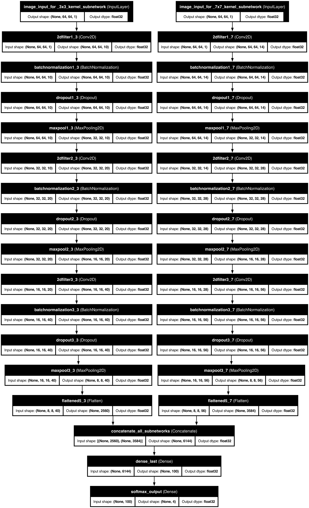
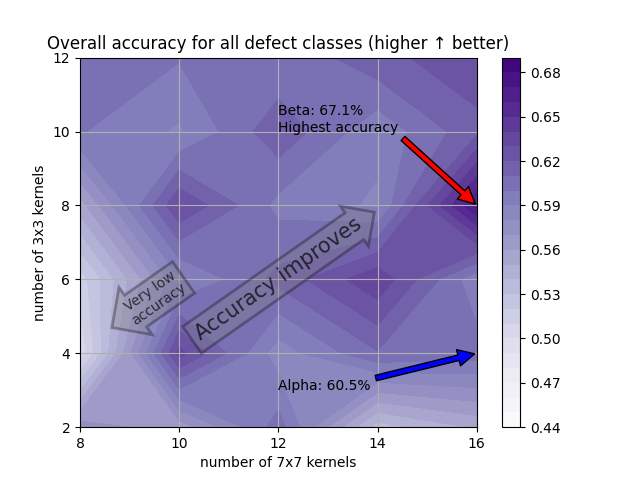
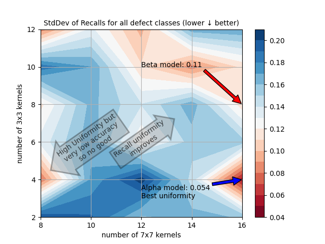
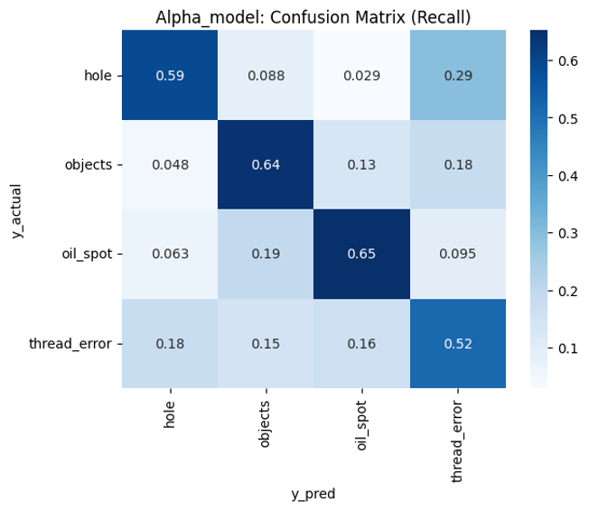
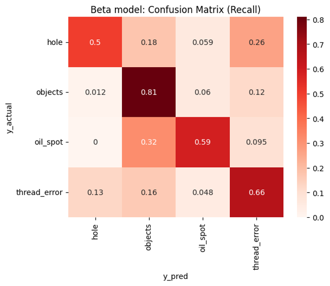
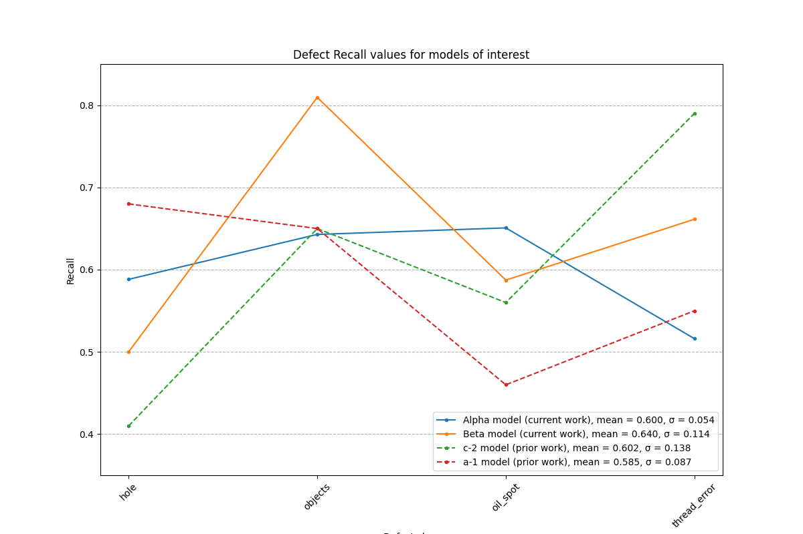
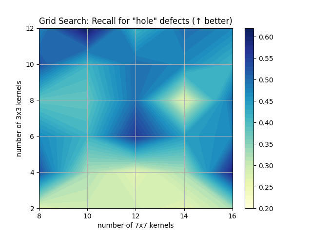
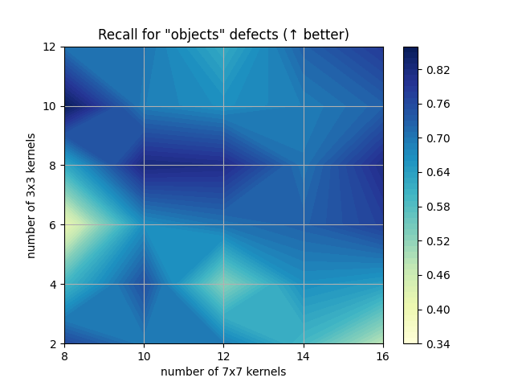
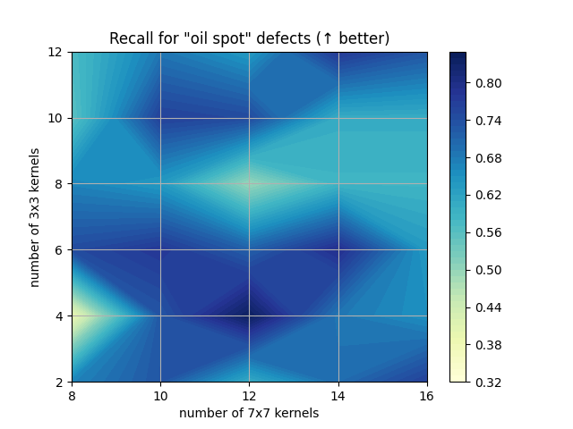
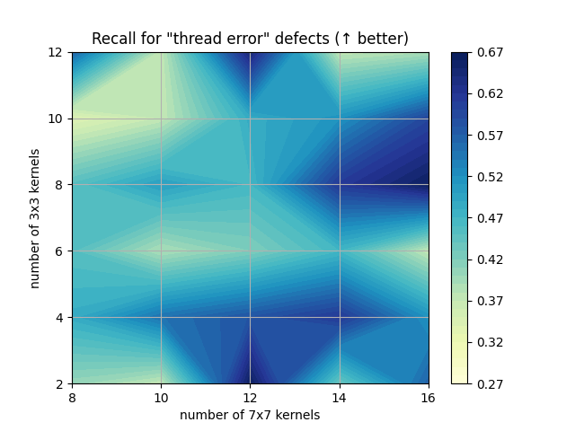

<h1>Toward a better defect classification model: <i>Mulitple kernels sizes</i></h1>

<h2>Background</h2>

In previous work, we have found the best kernels size for defect identification to be 7x7 with an overall accuracy of 63%.  However, there were some problems with this model.  It is not very effective in identifying holes.   The Recallholes was close to 41%, which make is not very effective.  At the same time, I noticed that the Recallholes was 68% for a 3x3 kernels models, even though the overall accuracy for that model was 58% and the Realloil_spot was a miserable 46%.  Since hole defects tend to be smaller, this results strong suggests that using a multi-size kernel model may yield better results.   This page describes this work.

<figure>

    <figcaption>Figure: Schematic of a CNN network with two kernel sizes (3x3 and 7x7) used in this work.</figcaption>
</figure>

<h3>Business needs:</h3>
A good starting point is the model should have high accuracy, but we can see from the previous work that a model trained with this singular goal is flawed: it did not perform well with <u>hole</u> defects.  

I do not work for Tilda. Nevertheless I will establish some reasonable assumptions on what the business needs of Tilda are.  Here we shall assume that there is a business need for Tilda to lift the Recall of every defect class to perform well while maintaining the overall accuracy to <b>≥60%.</b>  Thus the business needs are summarized as follows.

1.  Excellent overall performance. 
2.  Similar performance for all four classes.

<h2>Metrics</h2>
The above are represented by two metrics.

1.  <b>Accurracyoverall</b>:  This is simple the fraction of the predictions that is correct, regardless of the defect class.  This was the primary metric in the prior work.  (NB: One can argue Recall should be used here, but Accurancy and Recall are highly correlated, so it does not matter from a model selection standpoint.)

2.  <b>Recallstddev</b>:  The model should work similarly for all four classes.   The recall for each defect class is what fraction of the actual defects was classfied correctly by the model.  The speard of recall values for the four defect classes should be small.  We weight the four classes equally, even though the number of samples is different among all four classes.  A small standard deviation for the recall values of the four classes means the model work the similarly for all of them.

<h2>Top line summary</h2>

The best model we found was one with <b>10 3x3 kernels and 16 7x7 kernels</b> at the first layers.  We shall refer to this model as <i>Alpha</i>.  It achieved an overall accuracy of <i>60.5%</i>.   The Recall values were the most balanced, with an average of 60.0% and a standard deviation of <i>0.05</i>.  

<h2>One further improvements: Raising the learning rate</h2>

I changed the learning rate from 10-5 to  10-4.  Inititally I had thought that a smaller learning rate would ensure that the model will not miss the global minimum, even if this is done at the expense of training time and CPU/GPU cost.  I did this work on my Mac laptop so the latter of negligible.  However, after some further experimentation, I found the higher learning rate would not only cut the training time significantly, from 10 hours to 4 hours, but it also produced better results.  This is likely due to the following two reasons.
1. With a larger learning rate, the gradient descent search can more easily get out of a local minimum than with a smaller learning rate.
2. The learning rate for the <i>Adma</i> optimizer is really only the <i>starting</i> learning rate.  It in fact has some intelligence built in that fine tunes the instantaneous learning rate for each feature.   It consists two parts: momentum and RMSProp.  RMSProp adjusts the rate by the reciprocal of rms of the recent moves.  The smaller the variations of rate, the faster the model move in that feature.  The intuition is if there has been little variation in recent gradient for a particular feature, the minimum is not near, so the exploration can proceed faster.

<h2>Grid search results</h2>

We performed a grid search for difference combinations of numbers of 3x3 kernels and 7x7 kernels.  The figure below plots for each model the overall accuracy (which we want as high as possible) and the standard deviation of the recall across the four defect class (we want this to be as low as possible).  

We can see that the accuracy improves with more 3x3 kernels added to the model, as seen in Fig. (a) below. A little less clearly, but still visible is the trend that the uniformity of the performance across the 4 defect classes, as manifest by the standard deviation of the Recall value, as becomes better (i.e. smaller) with more 3x3 kernels added to the model.

We focus our attention on two models that show great promise: we call them Alpha and Beta, labeled in the contour plots.   Alpha has the most uniform Recall values (0.05), as show in the right figure below, but its over accuracy is 60.0%.  Beta has the highest overall accuracy (67.0%), but its recall values are less uniform (0.114).

It is worth noting that the Beta model, which has the best accuracy, is superior to model c-2 in the prior work, which has a 63.0% accuracy and an inferior uniformily 0.138, and the Alpha model, which has the best unifomity, is superior to model a-1 of the prior work, which had a Recall uniformity of 0.187 and an accuracyoverall of 58.0%.  We therefore believe that the two kernel size approach produces superior results over the single kernel size approach in the prior work.

<figure>

 

    <figcaption>Figure: (a) Accuracyoverall and (b) Recallstd dev of models with corresponding number of 3x3 and 7x7 kernels.  Arrows point to the two best models for each metric, with 
Alpha having the best Recallstd dev , and Beta has best Accuracyoverall.</figcaption>
</figure>
 
 

|  |Accuracyoverall | Recallmean | Recallstddev (Recall uniformity) |
| -- | -- | -- | -- | 
| alpha |60.5%|60.0%|0.054| 
| beta |67.1%|64.0%|0.114| 
| a-1 |58.0%|60.2%|0.087| 
| c-2 |63.0%|58.5%|0.138| 
  

<figure>

 

    <figcaption>Figure: (L) Recall values (at diagonals) of models of model Alpha and Beta.  Note Alpha performs more uniformly, but Beta excels in <i>objects</i> <i>and thread errors</i>.</figcaption>
</figure>
 
 

<figure>

    <figcaption>Figure: (L) Overall accurracy of models with corresponding number of 3x3 and 7x7 kernels</figcaption>
</figure>

<h2>Model performance for individual defect classes:</h2>

Recall values of each defect in each model.  While general trends are difficult to tease out, we can see that for the smaller defects of objects and holes, the performance is higher in model with more kernels (esp. 3x3 kernels), whereas for the larger or more diffused defects such as thread errors and oil spot, the performance is less dependent on the number of kernels.

1. A clear trend is the Recall of the <i>hole</i> defect class definitely improves with the addition of 3x3 kernels in the model.   That was the original intention of including them.   Hole defects tend to be smaller so 3x3 kernels may work better.
2. Recall for <i>Objects</i> class defects also seems to improve with more 3x3 kernels, although the trend is less obvious than for <i>hole</i> defects.  Object defects have a range of sizes but many of then are smaller as well.
3. The 3x3 kernels seem to have little efects for the other two classes, <i>oil_spot</i> and <i>thread_error</i>.  <i>Oil_spot</i> defects are long and width, and <i>thread_error</i> are long, so they may be less suitable for 3x3 kernels.

<figure>

   

    <figcaption>Figure: (L) Overall accurracy of models with corresponding number of 3x3 and 7x7 kernels</figcaption>
</figure>
 
 
<h2>Shap values analysis of model</h2>
Since the model has two branches, each image is processed through each branch and it pixels can generate negative and positive support for the class.   The effects of the two sizes of kernel are separated and can be compared directly.  Hence there are four columns instead of two.   

**1. Objects**

_CORRECT OBJECTS PREDICTIONS_

For detection of the <i>objects</i> class, we see that the model relies more on the large 7x7 kernels to detect them.  The red patches for <i>objects</i>, which are signals for that class for the model, are only seen on the 7x7 branch.

 
    

 

_INCORRECT OBJECTS PREDICTIONS_ (Should have been _Objects_):

This class was most commonly misclassified <i>thread errors</i>.  The two images below contain long streaks that look like a thread (compare this to a real thread error below).  Thus it is not surprising these images were misclassified as <i>thread errors.</i>

 
  

**2. HOLE**

Hole is a challenging category.  One reason is the lack of samples.  There are only 337 samples of _hole_ defects compared to 620 for the next numerous category of _thread error_.  In the prior work, we see signs that the 3x3 kernel model, which perform less well overall compared to the 7x7 kernel model, was effective in classifying the hole category.  I surmised that the smaller 3x3 kernels are better suited for the generally hole class defects.  From examples of shap_value images of the hole class below, we can indeed see that most of the red (postive) signal can come from the 3x3 kernels.

_CORRECT HOLE PREDICTIONS_:
    These images are classified as _holes_ mostly based only the positive shapley values of the _hole_ category.  

 

_INCORRECT HOLE PREDICTIONS_ (Should have been _Hole_):
    Hole class is also most often misclassied as <i>thread errors</i>.  We have two such examples here.  Both of which would not appear as <i>holes</i> to the human eye.  Note in both cases, the probabilities of prediction was not high even for the wrong class, indicating the uncertainty of the model.  This is likely a result of the dearth of training data resembling these defects that are correctly classfied.

 
**3. OIL SPOT**
    
_CORRECT OIL SPOT PREDICTIONS_:
    <i>Oil spot</i> images tend to have a diffused dark area.  Here are two correctly classified examples below.
 

  

_INCORRECT OIL SPOT PREDICTIONS_ (Should have been _Oil Spot_):
    The _oil spot_ images that foiled the model tend to look have large blotches that look like <i>objects</i>.  This is what happened in the first misclassified image below.  In the second image, there is a bright spot which strong resembles a <i>hole</i> and led the model to classify it as such.  

  
**4. THREAD ERROR**.
    
_CORRECT THREAD ERROR PREDICTIONS_:
    
<i>Thread_errors</i> tend to look 3-dimensional.  They can contain both long and "spotty" shapes at the same time.  Here we can see the 3x3 and 7x7 kernels working together to come to the correct classification.  However, note that in some cases the predicted probabilities are not 100%, indicating this is not an easy model to predict.

 

  

_INCORRECT THREAD ERROR PREDICTIONS_ (Should have been _Thread Error_):
The most common misclassifed <i>thread_errors</i> are directed to the <i>object</i> class.  That's because in both classes the defect looks somewhat 3-dimensional and can have an elongated shape.  The following are a couple of examples. Note the probabilities of the predictions are all less than 100%, indicating these are borderline cases and the model is not very "sure" about its predictions.
 

  
