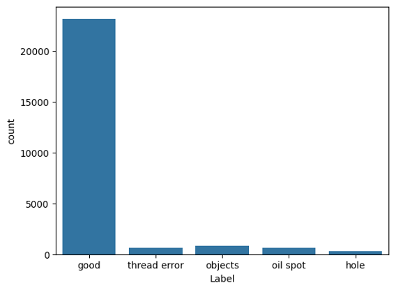
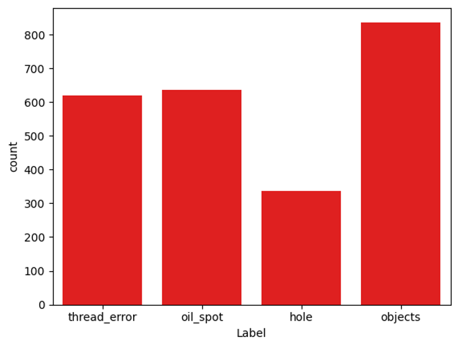

**Defect detection and classification on industrial fabric**

INTRODUCTION

Tilda (<https://www.tildafabricusa.com)>) is a fabric brand founded by Norwegian designer Tone Finnanger in 1999, best known for whimsical naive characters and charming fabric design.

The Tilda image dataset for defect detection/classification in fabric presents an image classification on an industrial context (<https://www.kaggle.com/datasets/angelolmg/tilda-400-64x64-patches>). It is based on the public dataset by the Deutsche Forschungsgemeinschaft's Texture analysis group from the University of Freiburg (<https://lmb.informatik.uni-freiburg.de/resources/datasets/tilda.en.html>) The original images were resized from 768x512 to 512x512, and then broken into 64x64 patches.

GOALS

1. Build a model that will detect defects images that contain defects. (2-class)
2. Build a model that will identify the defects in each image. (4-class)

KEY RESULTS

1. For the 2-class defect detection model, we achieved precision of 0.95 and 0.94, and recall if 0.997 and 0.49 for the good and defect class. The Area Under of th Curve (AUC) for the ROC is 0.90.
2. For the 4-class defect identification, we achieve an overall accuracy of 0.64, with the accuracies of 0.44, 0.60, 0.83, 0.79 for the defect classes of hole, objects, oil spot, thread error.

OVERVIEW OF DATA

1. The data is massively imbalanced, with 90.5% if the images being in the “good” class.

Below are the actual number of images for each class

| Class | Count |
| --- | --- |
| Good | 23170 |
| Thread error | 620 |
| Objects | 837 |
| Oil spot | 636 |
| Hole | 337 |

Note that even for the defects, there is a strong imbalance. The number of hole samples is less than half of the Objects. This helps explain why the hole results are inferior to the others.

SAMPLES OF IMAGES FROM EACH CLASS:

Good

Thread error (Defects)

Objects (Defects)

Oil spot (Defects)

Hole (Defects)

From the above random samples, one can see the original classification may not have been perfect. For example,

1. Sample 128_patch2-3.png under thread error does not contain any obvious defect to the naked eye.
2. Sample 086_patch4-3.png classified as good appears to have a defect that looks like a thread error on it.
3. Sample 034_patch3-1.png classified as a hole error does not appear to have a hole.

It is also interesting to note that the holes appear as bright spot, which leads me to believe that the contrast for all the samples have been reverse. However, that does not affect the modeling.