<h1>Defect detection and classification on industrial fabrics</h1>

<h3>Top line results</h3>

1.  I trained two CNN models, one to detect defects, another to identify what class the defect is.
2.  The best 2-class defect detection model (A-1, with 3x3 kernels and 8 x 2n kernels per block) has an ROC-AUC of **93.1%**, a Recall for the _good_ class of 95.8%, and a Recall of 58.4% for the _defect_ class at thresholds of 50%.   The model C-1 has a higher _Defect_ Recall of 61.7% but both its ROC-AUC and _Good_ Precision are lower at 91.8% and 95.0%, respectively.  Thus this model may be desirable for certain business use cases, but for our purpose, we will employ the classic metric of best ROC-AUC.  The model A-1 will be the best model for our analysis.
3.  The best 4-class defect identification model (c-2, with 7x7 kernels and 16 x 2n kernels per block) has an accuracy of **63.0%**, against a baseline of 25% (4 classes).  For this  4-class defect identification model, we achieve recall of 41.2%, 65.4%, 55.5%, 79.0% for the defect classes of _hole, objects, oil spot, thread error_, respectively.  Note there are 4 total classes so the baseline for a model that does "random guessing" is _25%_.  Thus the model is able extract signal.   In particular, this model performs very well for _objects_ and _thread error_, but not so well for holes.  This is largely because the dearth of _hole_ samples (only 337) vs. >600 for all other _Defect_ samples.

<h2>INTRODUCTION</h2>

Tilda [click to see Tilda website](https://www.tildafabricusa.com) is a fabric brand founded by Norwegian designer Tone Finnanger in 1999, best known for whimsical naive characters and charming fabric design.

The Tilda image dataset for defect detection/classification in fabric presents an image classification on an industrial context (<https://www.kaggle.com/datasets/angelolmg/tilda-400-64x64-patches>). It is based on the public dataset by the Deutsche Forschungsgemeinschaft's Texture analysis group from the University of Freiburg (<https://lmb.informatik.uni-freiburg.de/resources/datasets/tilda.en.html>) The original images were resized from 768x512 to 512x512, and then broken into 64x64 patches.

<h3>GOALS</h3>

While the details of the exact business use cases are not known, one can infer two high level needs: 
1. Build a model that will detect defects images that contain defects. (2-class).  It is undesirable to allow defected textile to reach the customers, so it should be screened out.
2. Build a model that will identify the defects in each image. (4-class).  This will help in the manufacturing process to diagnose problems in their production line.

<h3>OVERVIEW OF DATA</h3>
1. The data is massively imbalanced, with 90.5% if the images being in the “good” class.

Below are the actual number of images for each class
| Class | Count |
| --- | --- |
| Good | 23,170 |
| Thread error | 620 |
| Oil spot | 636 |
| Hole | 337 |
| Objects | 837 |

Note that even for the defects, there is a strong imbalance. The number of _hole_ samples is less than half of the Objects. This helps explain why the hole results are inferior to the others.

<h3>SAMPLES OF IMAGES FROM EACH CLASS:</h3>
Good

Objects (Defects)

Oil spot (Defects)

Hole (Defects)

Thread error (Defects)

From the above random samples, one can see the original classification may have contained many errors. Note this is especially a problem given the small sample sizes of the defect classes.  Here are 5 examples for the random sample above.

1. _Objects_: Both samples 152_patch_5-7.png and 371_patch_2-4.png do not appear to have any defects (so should have been in the _good_ class).
2. _Thread error_: Sample 128_patch2-3.png does not contain any obvious defect to the naked eye.
3. _Hole_: Sample 034_patch3-1.png does not appear to have a hole.
4. _Hole_: Sample 019_patch2-4.png appears to be an _objects_ defect instead of a _hole_ defect.

It is also interesting to note that the holes appear as bright spot, which leads me to believe that the contrast for all the samples have been reversed, or there is an illumination source from below the sample. However, that does not affect the modeling.

<h2>MODEL OVERVIEW</h2>

The images are 64x64 pixels. We employ a segmented approach. First we use a 2-class CNN model to <i>detect</i> the defects. Then we employ a 4-class model to <i>identify</i> the defects. Both models have a very similar architecture. In each, I employed a CNN network of 3 convolutional blocks, followed by a flattening, fully connected layer, and a finally softmax output layer. The only difference between the two models is the final softmax layer.

1. We experimented with four (4) convolutional kernel sizes: 3x3, 5x5, 7x7, and 9x9.  (Note previous we employed kernels with _even_ number sizes.)  However, I have learned since then that even kernel sizes lead to problems when you desire the output to have the same size as the input. see [link](https://medium.com/geekculture/why-is-odd-sized-kernel-preferred-over-even-sized-kernel-a767e47b1d77)
2. Each convolutional block starts with 8 or 16 conv. kernels.
3. They are successively doubled to 8x2n or 16x2n in the subsequent blocks.
4. After each batch normalization layer, a 0.1 dropout layer is applied for regularization.
5. Each block ends with a 2x2 maxpooling layer.
6. The final output block is quite generic. The size of the fully connected layer is about ¼ of the number of conv. kernels in the last conv. block. The softmax layer becomes a sigmoid layer when the number of classes = 2.
7. An evaluation data set (~10%) was used as the evaluation data set to monitor the progress of the model for _early stopping_.  
8. We employed the [Adams optimizer](https://www.geeksforgeeks.org/adam-optimizer), which adapts the learning rates for each feature by incorporating both momentum and the first and second moments of the gradient. 

<figure>
    
    <figcaption>Schematic diagram for both the 2-class and 4-class models used in this work</figcaption>
</figure>

<h3>ISSUES AND HOW THEY WERE ADDRESSED</h3>

**Kernel size**: Small kernels make the model train faster and can allow for more numerous kernels to be applied, whereas large kernels may capture correlations between features that are farther apart. I decided to employ only kernel sizes of 3x3, 5x5, 7x7, 9x9 because anything larger will be more than the half size of the output of the penultimate convolution block (Quick experiments, not shown here, indeed confirmed that the performance worsens as the kernel size gets bigger).

**Monochromicity**: The as-downloaded images contain the full complement of the 3 RGB colors, all having the same values. I reduced the dimensions from 64x64x3 to 64x64x1. However, this is tricky as some libraries automatically rescale the images, which is not desirable. At the end, I wrote my own function to perform this task.

**Dataset imbalance**: Each class is weighted by the inverse of its relative population during training. However, this is not sufficient. The problem is during _stochastic gradient descent_, the population of the minority class in each mini batch becomes so small that there are great variations of class populations from one mini batch to the next. For example, the _hole_ class has only 337 images. The test set has 0.1 of the population (34 images). If we have 32 minibatches, we will end up with only 2 _holes_ class images for each mini batch.
The solution is we upsample/downsample each class to a reasonable number. In the defect detection model, we downsample the _Good_ class to ~5120 samples, and upsample each of the defect classes to ~1240 samples (summing to ~5120 samples). This way, the sample sizes are balanced, and each minibatch has a good distribution of each population.

**Data augmentation**: It is a technique that involves generating additional images by modifying an original image, such as by flipping, rotating, reflecting, or changing the brightness and contrast of the image. Its use is widespread general image classification. However, in this case, I experimented with it and found the results to be markedly _worse_ than just simple upsampling. Therefore I did not employ this technique in this work.
**Maximizing Contrast**: This is one sub-example of **data augmentation** and may shed light into why data augmentation does not work in this use case. I performed a quick experiment in which I rescaled the pixel intensity to 0 ≤ i ≤ 1 instead of just dividing by 255, the performance became worse. I believe that is because the absolute intensity contains information about an object or feature’s height or depth which would be distorted or lost when the scales are changed. 

<h2>RESULTS</h2>
<h3>Defect DETECTION (Screen for defects, regardless of defect class)</h3>

I trained six model with the following parameters. They will be referred to as follows.
|     | **3x3 kernels** | **5x5 kernels** | **7x7 kernels** | **9x9 kernels** |
| --- | --- | --- | --- | --- |
| **8 kernels + 16 kernels + 32 kernels (8,16,32)** | A-1 | B-1 | C-1 | D-1 |
| **16 kernels + 32 kernels + 64 kernels (16,32,64)** | A-2 | B-2 | C-2 | D-2 |

<h4>Receiver Operational Characteristics (ROC-AUC)</h4>

For classification models with 2-classes, the most common tool is [Receiver Operational Characteristics](https://en.wikipedia.org/wiki/Receiver_operating_characteristic).  The metric is the Receiver Operational Characteristics Area Under the Curve (ROC-AUC).  A model that can perfectly separate two classes will have an ROC-AUC of 1, whereas a useless model that makes only random guesses will have an ROC-AUC of 0.5.

|     | **3x3 kernels** | **5x5 kernels** | **7x7 kernels** | **9x9 kernels** |
| --- | --- | --- | --- | --- |
| **8 kernels + 16 kernels + 32 kernels (8,16,32)** | **93.1%** | 91.8% | 91.8% | 88.4% |
| **16 kernels + 32 kernels + 64 kernels (16,32,64)** | 91.5% | 92.4% | 89.2% | 89.8% |

<figure>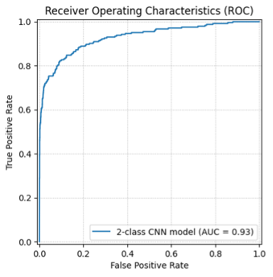
        <figcaption>Figure: Receiver Operation Characteristics curve for A-1, with Area Under the Curve of 93.1%</figcaption>
<figure>
 
 

<h4>Precision of <i>Good</i> class and Recall of <i>Defect</i> class</h4>
A business is in general interested in quality control, so it wants to maximize the purity of the <i>Good</i> class. The proper metric for this is <i>Precision</i>, which is the fraction of the predicted class that is actually correct.  That is, if a model finds 100 good samples in the data set, what fraction of them is correct, regardless of number of good samples of the original class?  For <i>Defects</i>, the focus of the business is different.  Here it is more interested in correctly identifying the defects based on its <i>actual</i> classification.  <i>Recall</i> is the fraction of the predicted <i>Defect</i> class that is correct, and so this is the other metric a business would be interested in.  
    
1.  Precision for the _Good_ class, because we don’t want the _Defected_ textile to be mixed in with the _Good_ and shipped to the customers.
2.  Recall for the _Defect_ class, because we want to correctly identify the actual defects.

|     | **3x3 kernels** | **5x5 kernels** | **7x7 kernels** | **9x9 kernels** |
| --- | --- | --- | --- | --- |
| **8 kernels + 16 kernels + 32 kernels (8,16,32)** | 95.8% | 95.0%* | 95.0%* | 95.0%* |
| **16 kernels + 32 kernels + 64 kernels (16,32,64)** | 94.5% | 95.4% | 96.1% | 94.4% |
* These values appear the same only by co-incidence.   They are different after the 3rd significant figure.

Table: Precision for the _Good_ class at 50% threshold (holdout) 
 

|     | **3x3 kernels** | **5x5 kernels** | **7x7 kernels** | **9x9 kernels** |
| --- | --- | --- | --- | --- |
| **8 kernels + 16 kernels + 32 kernels (8,16,32)** | 58.4% | 54.7% | **61.7%** | 44.0% | 
| **16 kernels + 32 kernels + 64 kernels (16,32,64)** |44.9% | 50.6% | 50.2% | 50.6% | 

Table: Recall for the _Defect_ class at 50% threshold (holdout) 
 

It is important to note that both these models are affected by the threshold for the output.  The model outputs a probability of it being a defect for each sample.  The threshold is the probability above which is a _Defect_ and below which is a _Good_.   Typically that is set at 50%.  On the other hand, there are use cases that are very sensitive to defects.  In such cases the threshold can be lowered to capture more _defects_ and produce a _purer_ good class, but this is done at the expense "wasting" samples that are marginally _Good_ and misclassifying them as _Defects_ by the model. 

<h4>2-class defect detection summary</h4>

While model A-1 has the largest ROC-AUC, which is the most-used metric to evaluation the effectiveness of a 2-class model, it is important to note that model C-2 has the best _Precision_ for the _Good_ class at 96.1%, and C-1 has the best _Recall_ for the _Defect_ class of 61.7%.  It is likely that C-1 performs better than A-1 only at the threshold of 50%.  The setting of this threshold depends on the business use case, which we are not privy to from the data set description.  In general, the model with the best ROC-AUC will have the best performance on the average, so we will follow the traditional metric of ROC-AUC and call A-1 our best 2-class model.

**Overall, the results are satisfactory given the simplicity of the model. The ROC-AUC of 93.1%.  The Precision for the _Good_ class of 96.1% is impressive, and the Recall for the _Defect_ class of 58.4% is an improvement over the previous iteration of the models, even if there is room for improvement.**

<h3>Defect IDENTIFICATION (4-class)</h3>

Identification of the defects is genrally an important step to continuous monitoring and improvement the manufacturing process. In this case here, it presents a much more challenging problem than the <i>Defect Detection</i> model.   
    1. The number of samples are small (see first table above _actual number of images for each class_). 
    2. There are 4 possibilities of defects, so the probability of getting it right is only about 25%. Note that 25% is the approximate baseline of the model: it must perform significantly above it for model to be called effective.

A close inspection of the images of defects in the **Sample images from each class** section will reveal that many classifications are almost arbitrary to the human eye. Some <i>oil spots</i> appear to be just some shades on the textile. The <i>holes</i> do not always appear to be holes. The _objects_ and _thread error_ classes are also similar looking. Some of the labels appear to be wrong.  Another issue is the imbalance of the data set. There are very few examples of the _hole_ cases. Thus it is not surprising the models perform the worst for the class.

We will use the lower-case letters to refer to these 4-class models here to identification avoid confusion with the 2-class models for detect detection.

|     | **3x3 kernels** | **5x5 kernels** | **7x7 kernels** | **9x9 kernels** |
| --- | --- | --- | --- | --- |
| **8 kernels + 16 kernels + 32 kernels (8,16,32)** | a-1 | b-1 | c-1 | d-1 |
| **16 kernels + 32 kernels + 64 kernels (16,32,64)** | a-2 | b-2 | c-2 | d-2 |

There are many ways to select the best model. Their selection depends on the use case.  For examples, some defects may be more costly to the company than others, so they should be emphasized more.  However, we are not privy to this information in this case, so we shall use the overall accuracy as the metric to select the best model, shown below. As one can see, they linger near the 50-60% levels.  While they are well above the baseline of ~25%, there is room for improvement.  

<h4>Total accuracy</h4>

|     | **3x3 kernels** | **5x5 kernels** | **7x7 kernels** | **9x9 kernels** |
| --- | --- | --- | --- | --- |
| **8 kernels + 16 kernels + 32 kernels (8,16,32)** | 58.0% | 61.7% | 59.3% | 60.9% |
| **16 kernels + 32 kernels + 64 kernels (16,32,64)** | 58.4% | 59.7% | 63.0% | 52.3% |

Table: Accuracy for each of the _Defect_ classes (holdout) 
 

We find the model c-2 is _nominally_ the best one.  As already noted, larger kernels or more kernels do not necessarily produce the same results.  In fact, the worst model is the 9x9 kernels with 16-32-64 kernels (d-2).  Large kernels may not be flexible enough to capture the intricacies of the irregularity of the defects in our images.   More kernels of the same size may end up causing the model to overfit the training data.  

<h4>Model c-2 (7 x 7 kernels, 16 kernels in the first layer)</h4>

The following are the relevant confusion matrix for model c-2. Recall measures how many of the actual defects were flagged by the model.  It is the best metric here because _a-priori_ we are not aware of any preference for a class.

<figure>

    <figcaption>Table: Confusion matrix for COUNT of each class (holdout) for model c-2,  <strong>7x7 </strong> kernels 16 on first block</figcaption>
</figure>
 
 

<figure>
    
    <figcaption>Table: Confusion matrix for RECALL of each class (holdout) for model c-2,   <strong>7x7</strong> kernals 16 on first block</figcaption>
</figure>
 
 

From the Recall confusion matrix, one can see the model performs especially well for the <i>thread error</i> and <i>objects</i> classes and poorly for the <i>hole</i> class. These are the most and least populous class in the data set, respectively, so this is all expected.
However it is also possible that the small sizes of the _hole_ defects may be more effectively extracted by smaller kernels.  We looked at the _Recall_ confusion matrix a-1 (**3x3** kernels with 8-16-32 kernels on the 3 blocks).  See below.

<figure>
    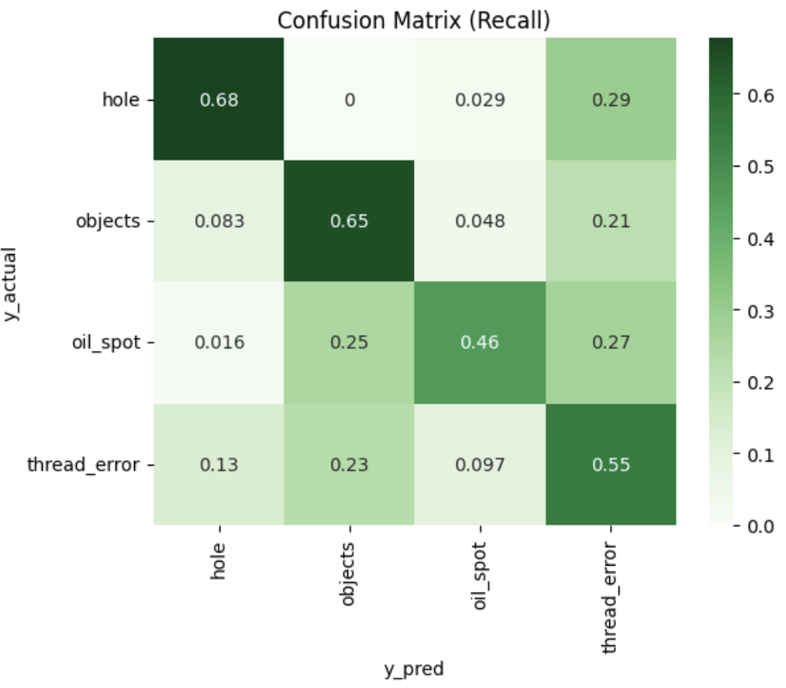
    <figcaption>Confusion matrix for RECALL of each class (holdout) model a-1  <strong>3x3</strong> kernels 8 on first block</figcaption>
</figure>
 
 

It turns out in this model (a-1, 3x3 kernels) the recall for _holes_ defects is much higher at 67.8%, but dropped for the other classes (the overall accuracy was 58.0%).  Thus, it shows that it is possible certain defects are better targeted by certain kernel sizes.

**Like its 2-class counterpart, the results of the 4-class model are satisfactory given the small data set and the large number of mislabeled data.  It achieved _Recall_ for the _Objects_ of 65% and _Thread_Errors_ of 79%, but did not perform well for the _hole_ class.**

**Future improvements opportunities**

1. There is strong evidence from the (4-class) defect identification model results with different kernel sizes can target different defect types. The new model with 2 or more kernel sizes instead of one should be explored.

2. The dearth of defect class samples is clearly a direct cause of inferior results (e.g. holes). One way to just artificially increase the weights of these samples so the model will pay more attention to them. However, this will be done at the expense of accuracy for the other classes. Another possible avenue to explore is to train a Generative Adversarial Network (GAN) to generate more defect samples. However, this work will require probably a lot more effort than building these two models so far, so the business case must justify it to proceed.

<h2>SHAPLEY value analysis</h2>

[_Shapley Values_](https://www.investopedia.com/terms/s/shapley-value.asp#:~:text=Essentially%2C%20the%20Shapley%20value%20is,or%20less%20than%20the%20others.) are derived from the _marginal contribution_ of each feature to a prediction while maintaining the values all other features. In game theory, Shapley values help determine how much each player in a collaborative game has contributed to the total payout. For a machine learning model, each feature is considered a "player". The Shapley value for a feature represents the average magnitude of that feature's contribution across all possible combinations of features. Specifically, Shapley values are calculated by comparing a model's predictions with and without a particular feature present. This is done iteratively for each feature and each sample in the dataset. By assigning each feature an importance value for every prediction, SHAP values provide a local, consistent explanation of how the model behaves. They reveal which features have the most impact on a specific prediction, whether positively or negatively. This is valuable for understanding the reasoning behind complex machine learning models such as [_deep neural networks_](https://www.kdnuggets.com/2023/08/shap-values-model-interpretability-machine-learning.html)

<u>In a CNN model, the basic feature is the pixel</u>. We employ the [shap](https://shap.readthedocs.io/en/latest/example_notebooks/overviews/An%20introduction%20to%20explainable%20AI%20with%20Shapley%20values.html) library [DeepExplainer](https://shap.readthedocs.io/en/latest/example_notebooks/image_examples/image_classification/Front%20Page%20DeepExplainer%20MNIST%20Example.html) function to visualize each pixel's contribution to the prediction. Because the shap library is a little out of date, I had to write my own wrapper code display the results [[see link](./TILDA-defect-classific/functions/shap_plot.py)].

Below show sample shap images of the two models. 
1.  In each case, there is a sample with red dots (right) and blue dots (left).  Red spots indicate pixels that support the hypothesis (_defect_ in the 2-class model, or _individual defect_ class in the 4-class model).  They work in opposition to each other, like positive and negative numbers, but in a non-linear fashion.   
2.  In the 4-class model, the defect class with the with the most red will "win".

<h3>DEFECT DETECTION (2-CLASS)</h3>

**TRUE POSITIVE (Actual = _Defect_, Predicted = _Defect_)**.

1. The image below shows the negative (blue) and positive (red) shapley values for each pixel of the image. The image was correctly classified by the model as _Defect_ (100% probability). One can see that the anomalous object on the lower right is drawing the positive attention (i.e. "there is a defect") of the model.  There is no feature that generated negative (i.e. "not defect") for the model. 

 

2. Another defect example is following, in which the model correctly located the anomalous feature on the image. There are scattered blue pixels in the image as well, but not nearly as numerous as red pixels to swing the prediction to negative.
 

 

**TRUE NEGATIVE (Actual = _Good_, predicted = _Good_)**.

For the correctly predicted _Good_ images, they typically fall into two types.
    
1. The images are very clean, and the model did not find any features of interest.  The following is an example.

 
2. The images are very noisy or "dirty."  It has all kinds of features but of the types that indicate a defect and ones that indicate a clean sample.  The blue (which indicate <i>good</i>) and red (which indicate <i>defects</i>) features are about equal in numbers, so they cancel each other.  Here is an example.

 

**FALSE POSITIVE (Actual = _Good_, Predicted = _Defect_)**

Like the True negatives, the images fell into two types.
    
1. Some of good images mentioned just above which are so noisy or "dirty" that the model mistook the noise for actual defects and misclassified them as such.  The following is an example.

 

2. The images are overall very clean but with very light features that are mistaken for a defect.  Below is an example. 

 

**FALSE NEGATIVE (Actual = _Defect_, Predicted = _Good_)**.

This is probably the most important error for a quality control, because the model is actually missing a sample that is defected.   There are two general types:
1. The defect feature is so faint it was difficult to catch.  Here is an example.

 

2. It is clear that some samples are mislabeled as defects. Below is an example. I challenge anyone to tell me this is a <i>defect</i>. The data set has many of these. The model, not surprising, only found a few pixels that would indicate there is a defect and classified it as <i>good</i>.
    

 

<h3>DEFECT DETECTION (4-Class)</h3>

When viewing the 4-class shapley plots, it is especially important to pay attention to the negative (blue) shapley values because they represent _counter-evidence_ of an image being in that class. Often an image is red on one side, but also blue or even blue on the other, thus the positive evidence all gets canceled.

**1. OBJECTS**
    
_CORRECT OBJECTS PREDICTIONS_
    Here are two examples in which there are strong red in classes other than the correct _object_ classes, but those were overwhelmed by the strong negative values. Thus this makes the _objects_ class as the most likely prediction.  Note in both cases there is also a lot of signal for the class _thread errors_, indicating the model having a hard time distinguishing them (see <i>Recall confusion matrix</i> above).
    
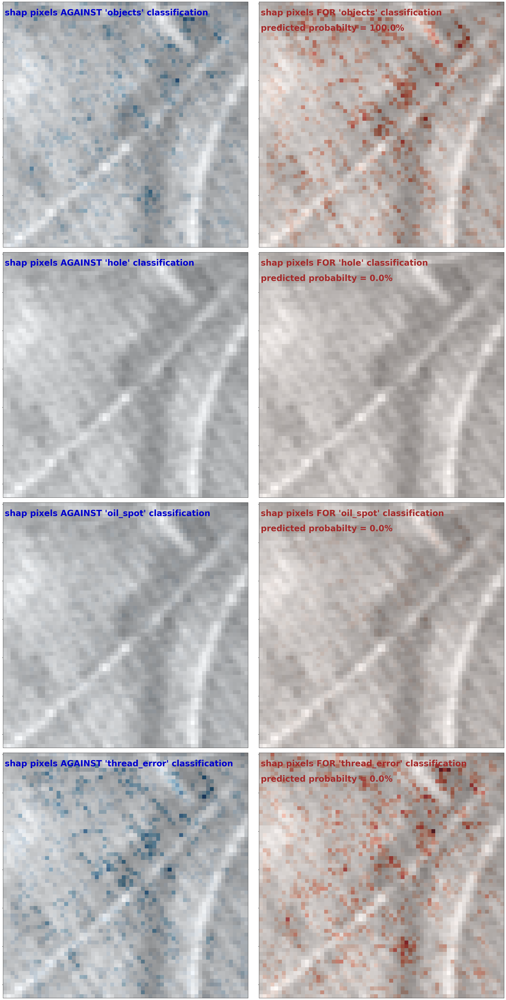 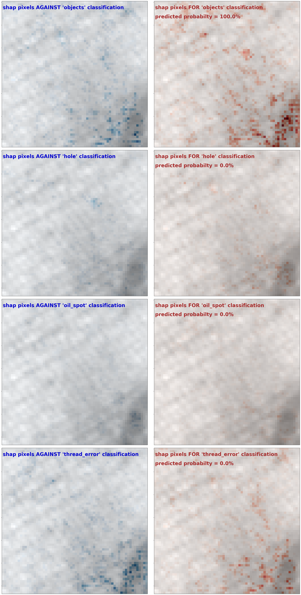

 

_INCORRECT OBJECTS PREDICTIONS_ (Should have been _Objects_):
     
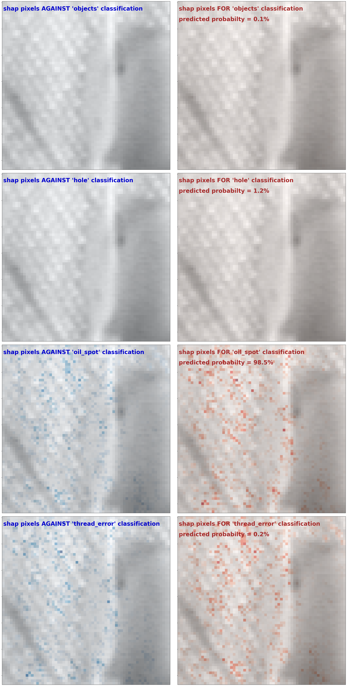 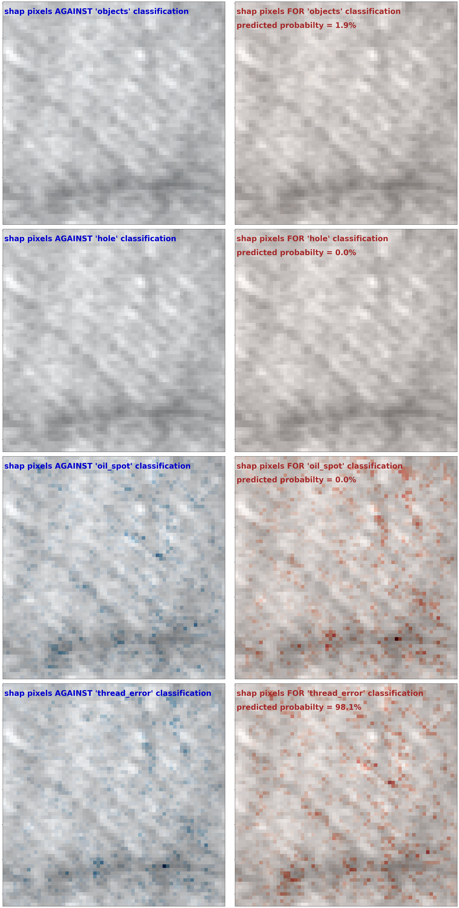

 

**2. HOLE**

Hole is a challenging category for the model.  One reason is the lack of samples.  There are only 337 samples of _hole_ defects compared to 620 for the next numerous category of _thread error_.  Another possibility is mislabeling.  I will demonstrate below.

_CORRECT HOLE PREDICTIONS_:
    These images are classified as _holes_ mostly based only the positive shapley values of the _hole_ category.  
 

 

_INCORRECT HOLE PREDICTIONS_ (Should have been _Hole_):
    The following two images both do not appear like _holes_.  This left image received a _thread error_ prediction, which appears to be correct.  The right image received an "object" prediction from the model.  I am not able to see any defects on the sample, so perhaps it should have been labeled as a _good_ sample. 
 

 

**3. OIL SPOT**
    
_CORRECT OIL SPOT PREDICTIONS_:
    Here is an image that can appear as an _oil spot_ or a _thread error_ to the human eye. However, the model correctly surmised there is more evidence for _oil spot_ and more counter-evidence against _thread error,_ and predicted _oil spot._ 
 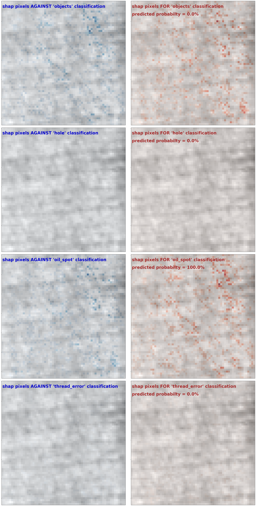

 

_INCORRECT OIL SPOT PREDICTIONS_ (Should have been _Oil Spot_):
    The _oil spot_ images that foiled the models tend to look have large blotches that look like objects.  This may be a case in which the model can be improved, perhaps by weighting this type of samples more in the training data set.  
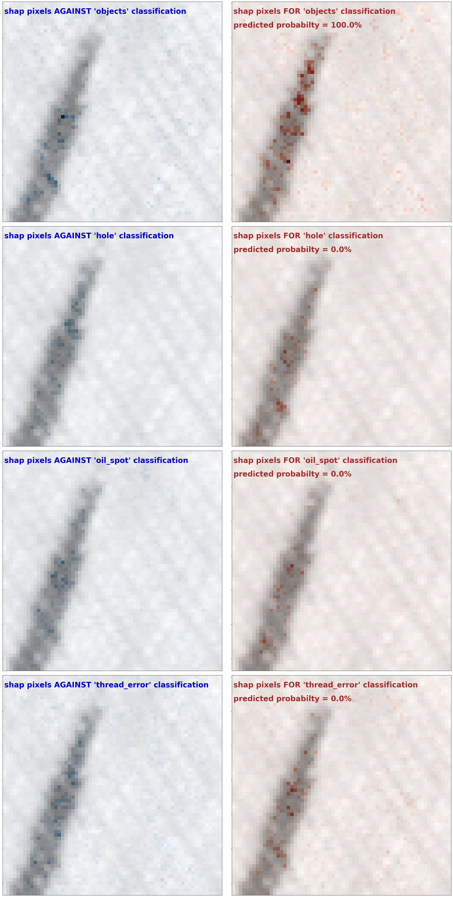 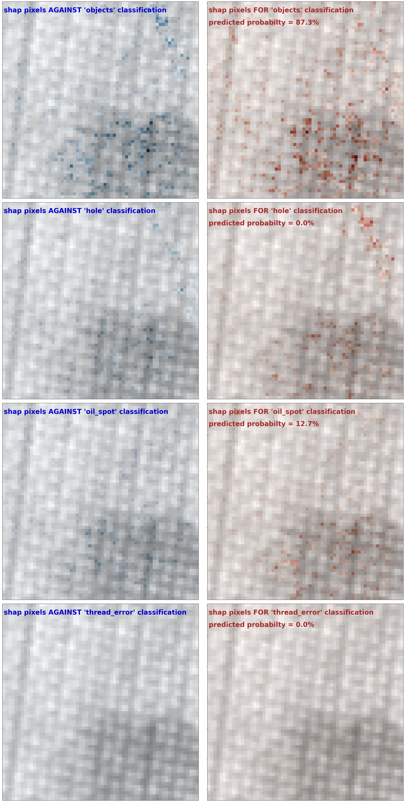

 
**4. THREAD ERROR**.
    
_CORRECT THREAD ERROR PREDICTIONS_:
    
The _thread errors_ defects tend to be bright objects that are long in shape. 
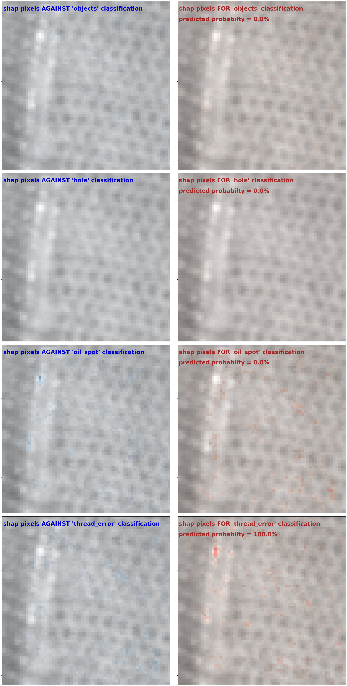 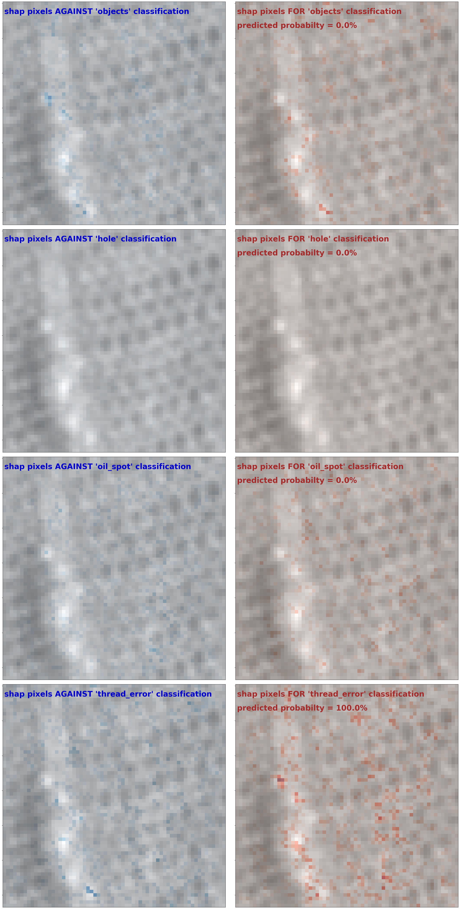

 

_INCORRECT THREAD ERROR PREDICTIONS_ (Should have been _Thread Error_):

The false _thread errors_ predictions tend _not_ to be long in shape. For example, the image on the right does not a have clearly defined bright spot, and so it was predicted as an _oil spot_.  The image on the left has a round bright or oblong bright spot, so it was predicted to be of _objects_ class.  It is entirely possible for these two images to have been mislabeled.  
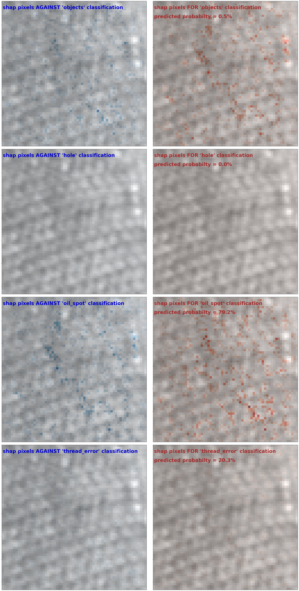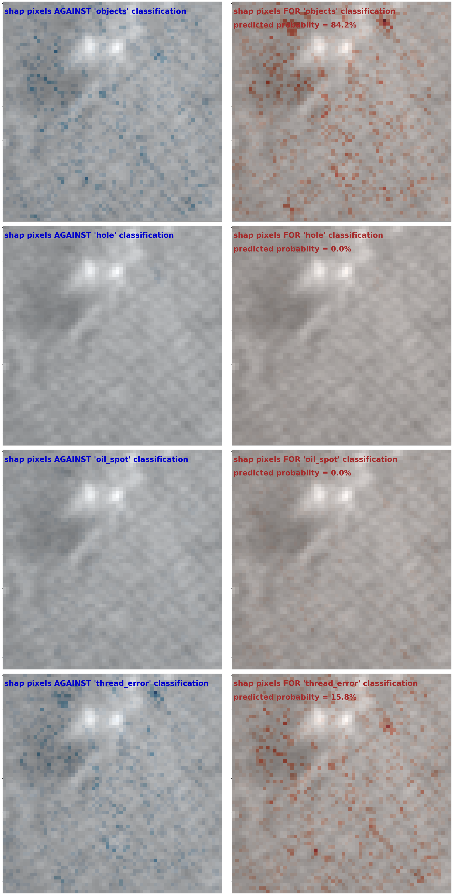

 

<h2>APPENDIX: CNN kernels (<em>For curiosity only, not much utility in this use case</em>)</h2>

It is generally interesting if not educational to examine the kernels to see what kinds of generalized features the CNN is paying attention to. For example, in the automobile classification model (<https://www.analyticsvidhya.com/blog/2021/06/beginner-friendly-project-cat-and-dog-classification-using-cnn/>) we can see the low-level features are built up to form higher level features that resemble car parts.
<figure>
    
    <figcaption>Kernels of the first 3 blocks for an automobile classification model</figcaption>
</figure>
 

Unfortunately, in this use case, the generalized features are not so obvious. The likely explanation is that the defects that are irregular in shape and sizes, so the fundamental building blocks more difficult to visualize the break-down. Nevertheless, **for completeness**, we show some selected examples of the features of the three convolutional blocks of the detection and identification models.

<h3>CNN KERNELS FOR <em>2-CLASS</em> DEFECT DETECTION MODEL:</h3>

**1st block kernels**

 

**2nd block kernels**

 

**3rd block kernels**

 

<h3>CNN KERNELS FOR <em>4-CLASS</em> DEFECT IDENTIFICATION MODEL:</h3>

**1st block kernels**

 

**2nd block kernels**

 

**3rd block kernels**

