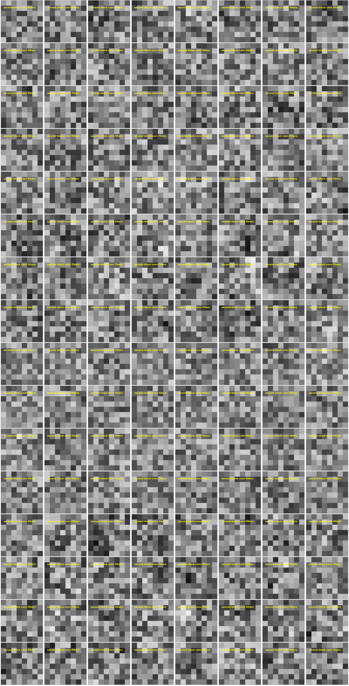
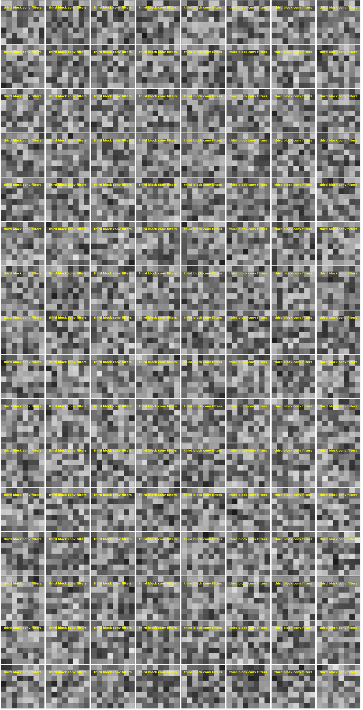
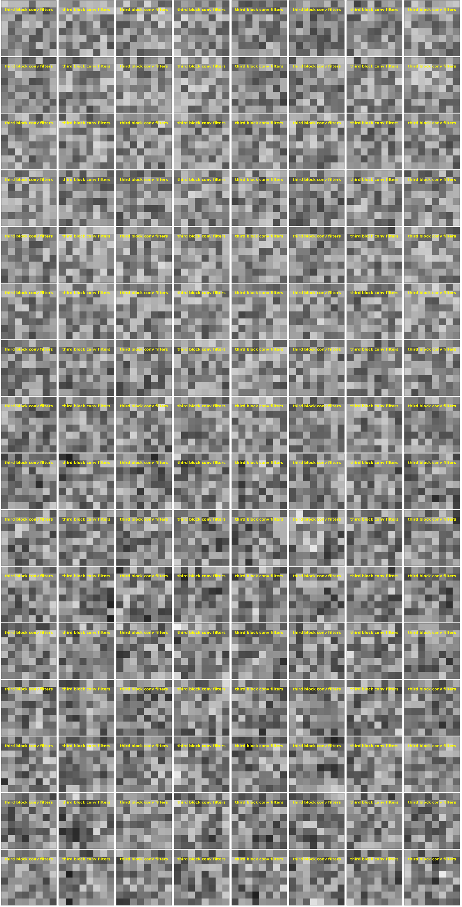

**Defect detection and classification on industrial fabric**

**Top line results:**

(This is a work in progress.  The functions are included here in the repo.  The jupyter notebooks used to execute the code will be provided later)
1.  I trained two CNN models, one to detect defects, another to identify what class the defect is.
2.  The 2-class defect detection model as an ROC-AUC of **93%**, and a Precision for the _good_ class of **96%** at 50% threshold.
3.  The 4-class defect identification model has an accuracy of **55%**, against a baseline of 25% (4 classes).  It works best for the _objects_ class at **73%** Recall, and worse for the _hole_ class at **21%** Recall.  These happen to be the most and least populous class repectively.
4.  It appears that the two convolutional filter (kernal) sizes are targeted toward different defects, with the 4x4 being better for the _hole_ and 8x8 better for the _objects_.  A logical next step would be to build a model that employs at least these two dimensions of filters.

INTRODUCTION

Tilda (<https://www.tildafabricusa.com)>) is a fabric brand founded by Norwegian designer Tone Finnanger in 1999, best known for whimsical naive characters and charming fabric design.

The Tilda image dataset for defect detection/classification in fabric presents an image classification on an industrial context (<https://www.kaggle.com/datasets/angelolmg/tilda-400-64x64-patches>). It is based on the public dataset by the Deutsche Forschungsgemeinschaft's Texture analysis group from the University of Freiburg (<https://lmb.informatik.uni-freiburg.de/resources/datasets/tilda.en.html>) The original images were resized from 768x512 to 512x512, and then broken into 64x64 patches.

GOALS
1. Build a model that will detect defects images that contain defects. (2-class)
2. Build a model that will identify the defects in each image. (4-class)

KEY RESULTS
1. For the 2-class defect detection model, we achieved precision of 0.95 and 0.94, and recall if 0.997 and 0.49 for the good and defect class. The Area Under of th Curve (AUC) for the ROC is 0.90.
2. For the 4-class defect identification, we achieve an overall accuracy of 0.64, with the accuracies of 0.44, 0.60, 0.83, 0.79 for the defect classes of hole, objects, oil spot, thread error.

OVERVIEW OF DATA
1. The data is massively imbalanced, with 90.5% if the images being in the “good” class.

Below are the actual number of images for each class

| Class | Count |
| --- | --- |
| Good | 23170 |
| Thread error | 620 |
| Objects | 837 |
| Oil spot | 636 |
| Hole | 337 |

Note that even for the defects, there is a strong imbalance. The number of hole samples is less than half of the Objects. This helps explain why the hole results are inferior to the others.

SAMPLES OF IMAGES FROM EACH CLASS:

Good

Thread error (Defects)

Objects (Defects)

Oil spot (Defects)

Hole (Defects)

From the above random samples, one can see the original classification may not have been perfect. For example,

1. Sample 128_patch2-3.png under thread error does not contain any obvious defect to the naked eye.
2. Sample 086_patch4-3.png classified as good appears to have a defect that looks like a thread error on it.
3. Sample 034_patch3-1.png classified as a hole error does not appear to have a hole.

It is also interesting to note that the holes appear as bright spot, which leads me to believe that the contrast for all the samples have been reverse. However, that does not affect the modeling.

**MODEL OVERVIEW**

The images are 64x64 pixels. We employ a segmented approach. First we use a 2-class CNN model to detect the defects. Then we employ a 4-class model to identify the defects. Both models have a very similar architecture. In both models, I employed a CNN network of 3 convolutional blocks, followed by a flattening, fully connected layer, and a finally softmax output layer. The only difference between the two models are the final softmax layer.

1. We experimented with two convolutional filter sizes: 4x4 and 8x8.
2. Each convolutional block starts with with 8 or 16 conv. filters.
3. They are successively doubled to 8x2n or 16x2n in the following blocks.
4. After batch normalization, a 0.1 dropout layer is applied.
5. Each block ends with a 2x2 maxpooling layer.

The final output block is quite generic. The size of the fully connected layer is ¼ of the number of conv. filters in the last conv. block. The softmax layer becomes a signmoid layer when the number of classes = 2.

ISSUES AND HOW THEY WERE ADDRESSED

**Filter size**: Small filters make the model train faster and can allow for more numerous filters to be applied, whereas large filters may capture correlations between features that are farther apart. I decided to employ only two sizes of 4x4 and 8x8 because 16x16 is already the half size of the output of the penultimate conv. block (Quick experiments, not shown here, confirmed it performed worse than the 4x4 and 8x8 filters).

**Monochromity**: The as-downloaded images contain the full complement of the 3 RGB colors, all having the same values. I reduced the dimensions from 64x64x3 to 64x64x1. However, this is tricky as some libraries automatically rescale the images, which is not desirable. At the end, I wrote my own function to perform this task.

**Dataset imbalance**: Each class is weighted by the inverse of its relative population during training. However, this is not sufficient. The problem is during stochastic gradient descent, the population of the minority class in each mini batch becomes so small that there is great variation from on mini batch to the next. For example, the hole class has only 337 images. The test set has 0.1 of the population (34 images). If we have 32 minibatches, we will end up with only 2 hole images for each mini batch.
The solution is we upsample/downsample each class to a reasonable number. In the defect detection model, we downsample the ‘good’ class to ~5120 samples, and upsample each of the defect classes to ~1240 samples (summing to ~5120 samples). This way, the sample sizes are balanced, and each minibatch has a good distribution of each population.

**Data augmentation**: It is a technique that involves generating additional images by modifying an original image, such as by flipping, rotating, reflecting, or changing the brightness and contrast of the image. Its use is widespread general image classification. However, in this case, I experimented with it and found the results to be markedly _worse_ than just simple upsampling. Therefore I did not employ this technique in this work.

**Contrast**: This is one sub-example of data augmentation and may shed light into why data augmentation does not work in this use case. I performed a quick experiment in which I rescaled the pixel intensity to 0 ≤ i ≤ 1 instead of just dividing by 255, the performance became worse. I believe that is because the absolute intensity contains information about an object or feature’s height or depth which would be distorted or lost when the scales are changed. By the same token you would not apply image rotation to an auto-driving use case, since cars are never upside down, or image reflection to facial recognition since there is a difference between one’s regular and reflected image (e.g. hair partition).

I trained four model with the following parameters. They will be referred to as follows.

|     | **4x4 filters** | **8x8 filters** |
| --- | --- | --- |
| **8 filters + 16 filters + 32 filters (8,16,32)** | A-1 | B-1 |
| **16 filters + 32 filters + 64 filters (16,32,64)** | A-2 | B-2 |

**_RESULTS_**

**Defect DETECTION**

Receiver Operational Characteristics (ROC-AUC)

|     | **4x4 filters** | **8x8 filters** |
| --- | --- | --- |
| **8 filters + 16 filters + 32 filters (8,16,32)** | 89% | 93% |
| **16 filters + 32 filters + 64 filters (16,32,64)** | 93% | 90% |

The following shows the ROC for the model B-1:

Precision

In a typical use case, the precision for the “good” class is the most important criterion, because we don’t want the “defected” textile to be mixed in with the “good” and shipped to the customers. The following is the precision confusion matrix for the model at 50% threshold with 8x8 (16,32, 64) filters. The threshold is set to 0.5. As one can see, the good predictions are 95% correct and the defect predictions are 92% correct.

Precision for the “good” class at 50% threshold.

|     | **4x4 filters** | **8x8 filters** |
| --- | --- | --- |
| **8 filters + 16 filters + 32 filters (8,16,32)** | 94% | 96% |
| **16 filters + 32 filters + 64 filters (16,32,64)** | 95% | 95% |

Recall for the “good” class at 50% threshold.

|     | **4x4 filters** | **8x8 filters** |
| --- | --- | --- |
| **8 filters + 16 filters + 32 filters (8,16,32)** | 100% | 99% |
| **16 filters + 32 filters + 64 filters (16,32,64)** | 100% | 99% |

Note the recall values are very close to 100% due to rounding. It is conceivable to raise the value of Precision for the good class by moving the threshold without sacrificing too many “good” images.

**2-class defect detection summary**

1. Overall, the results are quite satisfactory given the simplicity of the model. The ROC-AUC of 93 is quite impression, especially given the abundance of images that are hard to classified even with the human eye.
2. It is possible that the B2 model, which was the most elaborate model and had been expected to produce the best results, was overfitting the data, which does not have such a large defect set.

**Defect IDENTIFICATION**

Identification of the defects can be an important step to improving of the manufacturing process. From a modeling perspective, it presents a much more challenging problem. For one thing, the number of samples are small (see first table above _actual number of images for each class_). Further, there are 4 possibilities of defects, so the probability of getting it right is only about 25%. Note that 25% is the approximate baseline of the model: it must perform significantly above it for model to be called effective.

A close inspection of the images of defects in the section earlier will reveal that many classifications are almost arbitrary. The oil spots appear to be just some shades on the textile. The holes do not always appear to be holes. The objects and thread error classes are also similar looking. Another issue is the imbalance of the data set. There are very few examples of the “hole” cases. Thus it is not surprising the models perform the worst for the class.

We will use the lower-case letters to refer to these 4-class models here to identification avoid confusion with the 2-class models for detect detection.

|     | **4x4 filters** | **8x8 filters** |
| --- | --- | --- |
| **8 filters + 16 filters + 32 filters (8,16,32)** | a-1 | b-1 |
| **16 filters + 32 filters + 64 filters (16,32,64)** | a-2 | a-2 |

Below is the overall accuracy of the model. As one can see, the accuracy of the A1 model is barely above the baseline, probable because of its simplicity. As for the most complex model B2, again it does not perform as well as the two models of medium complexity.

We use the overall accuracy as the metric to select the best model. The results are summarized below.

Total accuracy

|     | **4x4 filters** | **8x8 filters** |
| --- | --- | --- |
| **8 filters + 16 filters + 32 filters (8,16,32)** | 30% | 55% |
| **16 filters + 32 filters + 64 filters (16,32,64)** | 56% | 42% |

We can see the model a-2 is the best one, marginally better than b-1. The a-1 model is barely above the 25% baseline, probably because the this is now a 4-class problem with too much complexity for it. The most complex model, b-4, does not perform well probably because of overfitting.

**Model b-1 (8 x 8 filters)**

The following are the relevant confusion matrix for model B-2. Recall is a better metric here because a-prior we are not aware of any preference for a class, like we know the defect class is highly undesirable for the 2-class model and needs to be screened out.

Here one can see the model performs especially well for the “objects” class and poorly for the “hole” class. These are the most and least populous class in the data set, respectively, so this is all expected.

Model a-2 (4 x 16 filters)

It is educational to compare the confusion matrices of B-1 to A-2, the model that comes in close second. Here we can see the model performing significantly better for the “hole” class, but not as well for the “objects” class. Is it because the small CNN filter size, which are more flexible, can capture the details of the “hole” features, whereas the large filter size of 8x8 can capture the “objects”, which tend to be larger than the holes.

There one direction to take in future work is to use a hybrid feature size approach (mix of 4x4 and 8x8 filters) for our CNN model.

**Improvements opportunities**

1. There is strong evidence from the (4-class) defect identification model results that different filter sizes can target different defect types. The new model should have 2 or more filter sizes instead of one.

2. The dearth of defect class samples is clearly a direct cause of inferior results (e.g. holes). One way to just artificially increase the weights of these samples so the model will pay more attention to them. However, this will be done at the expense of accuracy for the other classes. Another possible avenue to explore is to train a Generative Adversarial Network (GAN) to generate more defect samples. However, this work will require probably a lot more effort than building these two models so far, so the business case must justify it to proceed.

**_SHAPLEY value analysis_**

[_Shapley Values_](https://www.investopedia.com/terms/s/shapley-value.asp#:~:text=Essentially%2C%20the%20Shapley%20value%20is,or%20less%20than%20the%20others.)  are derives from the _marginal contribution_ of each feature to a prediction, after applying all other features. In game theory, Shapley values help determine how much each player in a collaborative game has contributed to the total payout. For a machine learning model, each feature is considered a "player". The Shapley value for a feature represents the average magnitude of that feature's contribution across all possible combinations of features. Specifically, Shapley values are calculated by comparing a model's predictions with and without a particular feature present. This is done iteratively for each feature and each sample in the dataset. By assigning each feature an importance value for every prediction, SHAP values provide a local, consistent explanation of how the model behaves. They reveal which features have the most impact on a specific prediction, whether positively or negatively. This is valuable for understanding the reasoning behind complex machine learning models such as [_deep neural networks_](https://www.kdnuggets.com/2023/08/shap-values-model-interpretability-machine-learning.html)

In a CNN model, the basic feature is the pixel. We employ the [shap](https://shap.readthedocs.io/en/latest/example_notebooks/overviews/An%20introduction%20to%20explainable%20AI%20with%20Shapley%20values.html) library [DeepExplainer](https://shap.readthedocs.io/en/latest/example_notebooks/image_examples/image_classification/Front%20Page%20DeepExplainer%20MNIST%20Example.html) function to visualize each pixel contribution to the prediction. Because the shap library is a little out of date, I had to write my own code display the results.

DEFECT DETECTION (2-CLASS)

**True positive (Actual = “defect”, Predicted = “defect”)**

The image below shows the negative (blue) and positive (red) shapley values for each pixel of the image. The image was correctly classified by the model as “defect” (87.4% probability). One can see a big contributor is the trench-like vertical feature, which has a concentration of red dots.

Another defect example is following, where there is a concentration of red pixels within and near the edges of the white diagonal streak. It may be that the edges are indicators of a defect. There are blue pixels near the feature edge as well, but not as numerous as red pixels.

**True negative (Actual = “good”, predicted = “good”)**

For the correctly predicted "good" images, in general the red pixels tend to be less clustered, with less intensity, even when they are more numerous than the negative (blue) pixels.

**False positives (Actual = “Good”, Predicted = “Defect”)**

These tend to images that have small dots which are not considered defects. They typically are just “blemishes” that got misrecognized by the model as a defect.

**False negative (Actual = “defect”, Predicted = “good”)**

These are the most important defects that needs to be greatly minimized if not eliminated. In most cases, the defects are just not very well formed.

DEFECT DETECTION (4-Class)

When viewing the 4-class shapley plots, it is especially important to pay attention to the negative (blue) shapley values because they represent _counter-evidence_ of an image being in that class. Often an image is red on one side, but also blue or even blue on the other, thus the positive evidence all gets canceled.

CORRECT PREDICTIONS

1. Objects
    
    Here are two examples in which there are strong red in classes other than the correct “object” classes, but those were overwhelmed by the strong negative values. Thus this makes the object class as the most likely prediction.

    
    

2. Hole
    
    On the other hand, this image is classified as hole mostly based only the positive shapley values of the “hole” category.

    

3. Oil spot
    
    Here is an image the can appear as an _oil spot_ or a _thread error_ to the human eye. However, the model correctly surmised there is more evidence for _oil spot_ and more counter-evidence against _thread error,_ and predicted _oil spot._

    

4. Thread error
    
    Below is another example of a close call between _thread error_ and _oil spot._ It is very challenging for the human eye to tell between the two, but in this case, the model predicted correctly.

    

ERRORS

For brevity, I will only discuss the three most common errors. They represent about 40% of the total mispredictions:

1. Object (actual) --> Oil spot (predicted)
    
    In this image, the model actual predicted there’s a 38% chance it is an object. However, it appeared to be thrown off by the smearing of the image on the right side.

     

2. Hole --> Thread error
    
    Honestly this looks more like a thread error to me. Again the model recognizes that there is a 26% chance it is a hole.

     

3. Thread error --> Oil spot
    
    I frankly do not know how the following image is a thread error. I think it is reasonable to classify it as a oil spot. (new)

    

    

APPENDIX: CNN FILTERS  (For curiosity only, not much utility in this use case)

It is generally interesting if not educational to examine the filters to see what kind of features the CNN is paying attention to. For example, in the automobile classification model (<https://www.analyticsvidhya.com/blog/2021/06/beginner-friendly-project-cat-and-dog-classification-using-cnn/>) we can see the the low-level features are built up to form higher level featues that resemble car parts.

Unfortunately, in this use case, the features are not so obvious. The likely explanation is that the defects that are irregular in shape and sizes, so the fundamental building blocks more difficult to visualize the break-down. Nevertheless, **for completeness**, we show some selected examples of the features of the three convolutional blocks of the detection and identification models.

CNN FILTERS FOR **2-CLASS** DEFECT DETECTION MODEL:

1st layer filters

2nd block filters (random sample of 128)

3rd block filters (random sample of 128)

CNN FILTERS FOR **4-CLASS** DEFECT IDENTIFICATION MODEL:

1st layer filters

2nd block filters (random sample of 128)

3rd block filters (random sample of 128)

