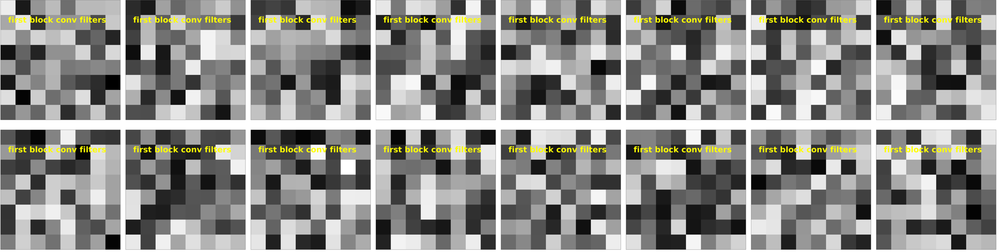
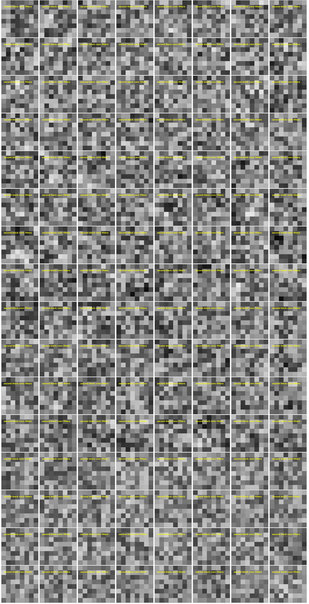

CNN FILTERS

It is generally interesting if not educational to examine the filters to see what kind of features the CNN is paying attention to. For example, in the automobile classification model (<https://www.analyticsvidhya.com/blog/2021/06/beginner-friendly-project-cat-and-dog-classification-using-cnn/>) we can see the the low-level features are built up to form higher level featues that resemble car parts.

Unfortunately, in this use case, the features are not so obvious. The likely explanation is that the defects that are irregular in shape and sizes, so the fundamental building blocks more difficult to visualize the break-down. Nevertheless, **for completeness**, we show some selected examples of the features of the three convolutional blocks of the detection and identification models.

CNN FILTERS FOR **2-CLASS** DEFECT DETECTION MODEL:

1st layer filters

2nd block filters (random sample of 128)

3rd block filters (random sample of 128)

CNN FILTERS FOR **4-CLASS** DEFECT IDENTIFICATION MODEL:

1st layer filters

2nd block filters (random sample of 128)

3rd block filters (random sample of 128)

